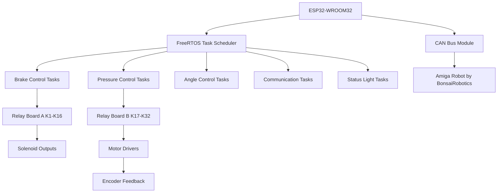

# VKMPD Wiedeg Electronica

## Overview

VKMPD Wiedeg Electronica is an ESP32-based embedded control system developed at Avans Hogeschool for the electronic control and actuation of the Wiedeg mechanical platform.

The project combines:

- Real-time task scheduling using FreeRTOS
- Distributed actuator control
- Relay-driven solenoid management
- Encoder feedback processing
- CAN bus communication
- Multi-voltage power distribution
- Embedded motor control systems

The software architecture is modular and task-oriented, allowing the system to scale and remain maintainable during continued hardware and software development.

---

## System Architecture

The system is centered around an ESP32-WROOM controller running multiple FreeRTOS tasks.

### Main Functional Subsystems

- Brake and solenoid control
- Force adjustment actuators
- Angle adjustment actuators
- Encoder feedback acquisition
- Communication handling
- Status indication and diagnostics
- Real-time control loop management

### High-Level Architecture



---

## Hardware Platform

### Main Controller

- ESP32-WROOM32 (38-pin variant)
- Arduino framework
- FreeRTOS-based multitasking
- PlatformIO build environment

### Power Distribution

The system operates from a 44V battery input and generates multiple regulated voltage rails.

| Voltage Rail | Purpose |
|---|---|
| 44VDC | Main battery input |
| 24VDC | Motor drivers and signaling |
| 12VDC | Solenoids and relays |
| 5VDC | Logic, encoders, communication |

### Communication

- CAN bus interface
- UART support
- I2C support
- SPI support

### Relay Control

Two relay boards are used for actuator and solenoid switching:

| Relay Board | Function |
|---|---|
| K1-K16 | Solenoid control |
| K17-K32 | Actuator and signaling control |

### Motor Control

The platform uses dedicated motor drivers for:

- Force adjustment actuators
- Angle adjustment actuators

Encoder feedback is used for positional and directional control.

---

## Software Architecture

The project follows a layered embedded software structure.

```text
src/
├── Tasks_Framework/
├── Tasks_Custom/
├── Hardware_Config.h
├── Function_Config.h
├── Config.h
└── RTSW_5_ButtonInterrupts_Framework.cpp
```

### Framework Layer

The framework layer provides reusable RTOS infrastructure and platform abstraction.

#### Included Framework Tasks

| Task | Purpose |
|---|---|
| TaskHeartbeat | System heartbeat and monitoring |
| TaskCLIHandler | Serial command line interface |
| TaskCommandHandler | Command processing |

### Custom Application Tasks

Application-specific functionality is implemented inside `Tasks_Custom/`.

| Task | Purpose |
|---|---|
| TaskBrakes | Solenoid brake control |
| TaskPressure | Pressure and force management |
| TaskAngle | Angle control and positioning |
| TaskCommunicate | Communication handling |
| TaskStatusLight | Tower light and diagnostics |

### RTOS Features

The system uses FreeRTOS with:

- Core-pinned tasks
- Semaphores
- Queues
- Runtime statistics
- Watchdog support
- Inter-task communication

---

## Software Dependencies

### Build Environment

- PlatformIO
- Arduino framework for ESP32
- Espressif32 platform

### External Libraries

| Library | Purpose |
|---|---|
| ESP32OLEDSSD1306 | OLED display support |
| I2CEEPROM | EEPROM access |
| ESP32Encoder | Encoder processing |

### Internal Platform Libraries

The project includes a large set of reusable platform abstraction libraries.

Examples include:

- ADC3208Lib
- DAC4922Lib
- IOLib
- InterruptLib
- LEDLib
- OLEDLibESP32
- QC7366Lib
- UART740Lib
- SPILib
- TaskSleep

These libraries provide hardware abstraction and simplify portability and maintenance.

---

## Electrical System Overview

### Power Conversion

The electrical architecture uses multiple DC-DC converters:

| Converter | Function |
|---|---|
| DDR-60L-12 | 44V → 12V |
| DDR-120C-24 | 44V → 24V |
| DDR-15L-5 | 44V → 5V |
| DDR-480C-12 | High-current 12V supply |

### Signal Tower

The system includes a multi-state signal tower for status indication:

- Red
- Yellow
- Green
- Blinking state support
- Continuous state support

---

## Development Environment

### Recommended Tools

| Tool | Purpose |
|---|---|
| Visual Studio Code | Main IDE |
| PlatformIO | Build and upload environment |
| Git | Version control |

### Supported Target

| Target | Framework |
|---|---|
| NodeMCU-32S | Arduino |

---

## Engineering Notes

- The architecture is designed for modular expansion.
- Hardware mappings are centralized in configuration headers.
- Tasks are isolated to improve maintainability and debugging.
- The project uses hardware abstraction extensively to simplify migration and testing.
- Several modules remain under active development and verification.

---

## Safety and Reliability

The system includes:

- Watchdog integration
- RTOS task monitoring
- Heartbeat supervision
- Isolated control layers
- Hardware abstraction for safer testing

Additional electrical and mechanical safety measures must be implemented before deployment in production or safety-critical environments.

---

## Repository Structure

```text
ProductDevelopment_Harrow/
├── include/
├── lib/
│   ├── fmap/
│   └── platformlibs/
├── src/
│   ├── Tasks_Framework/
│   ├── Tasks_Custom/
│   ├── Config.h
│   ├── Function_Config.h
│   ├── Hardware_Config.h
│   └── RTSW_5_ButtonInterrupts_Framework.cpp
├── platformio.ini
└── README.md
```

---

## Project Information

| Item | Value |
|---|---|
| Project | VKMPD Wiedeg Electronica |
| Institution | Avans Hogeschool |
| Department | Product Development |
| Platform | ESP32-WROOM32 |
| Framework | Arduino + FreeRTOS |
| Build System | PlatformIO |

---

## Authors

| Name | Role |
|---|---|
| Oliver Hofman | Embedded Software & Electronics |
| Roel Smeets | Framework Development |

---

## License

This project was developed as part of an educational engineering project at Avans Hogeschool.

Usage, modification, and distribution rights depend on project ownership and institutional agreements.

